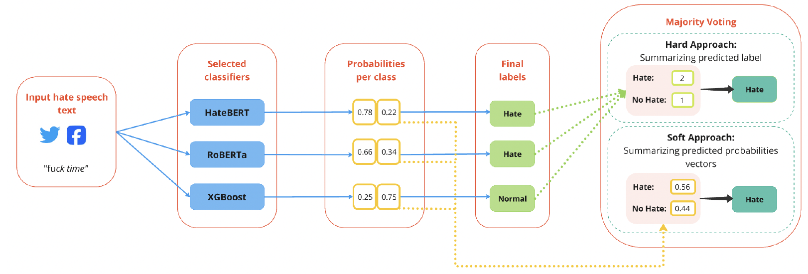
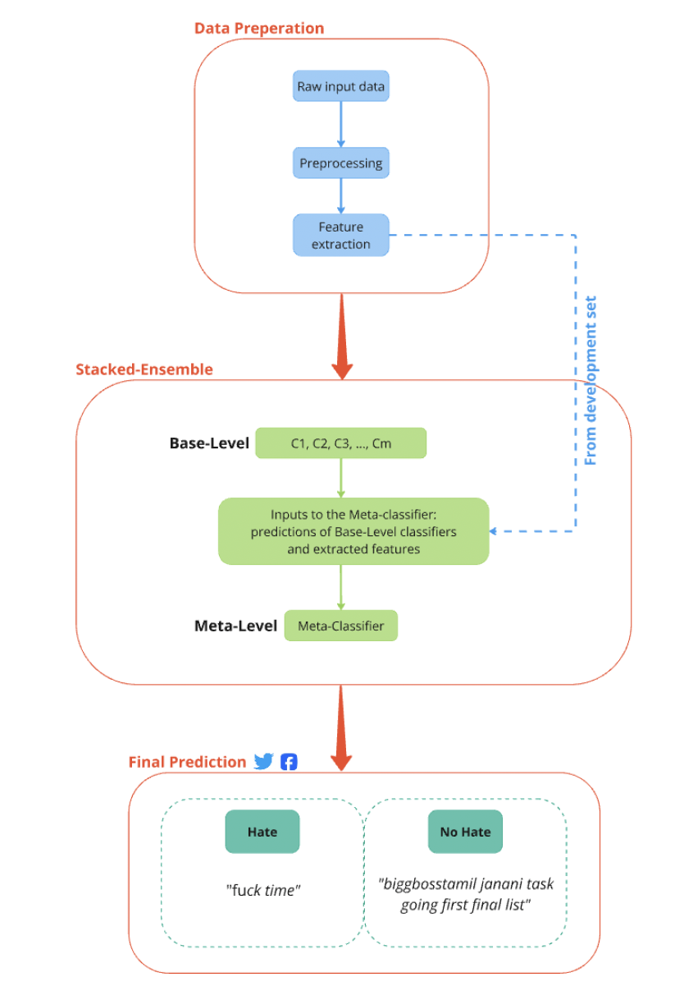
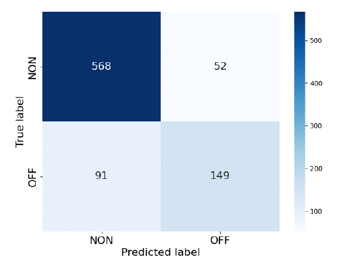
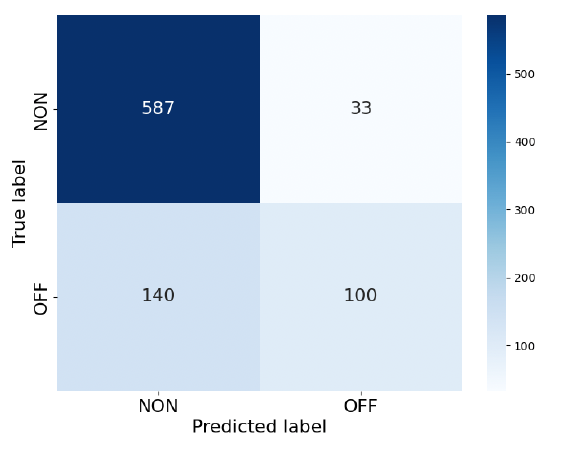
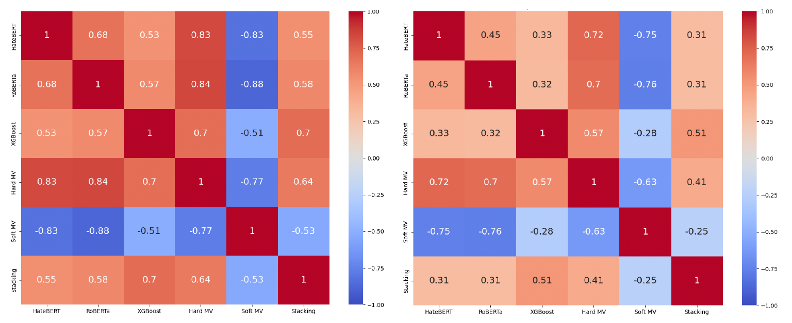
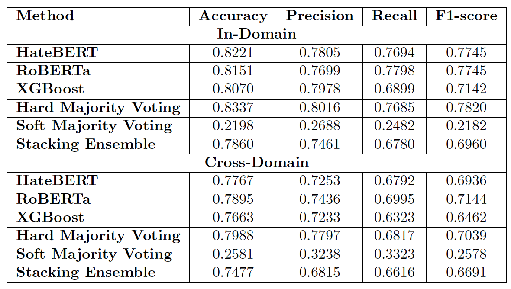

# Hate Speech Detection with Ensemble Learning
This project builds ensemble models to improve hate speech detection across different social media platforms. Using the OLID and HASOC datasets, we combined models like HateBERT, RoBERTa, and XGBoost through majority voting and stacking strategies.

---

## 📁 Project Structure

| File/Folder              | Description                                      |
|--------------------------|--------------------------------------------------|
| `hate_speech_detection.ipynb` | Main training and evaluation notebook           |
| `requirements.txt`       | List of python packages needed                   |
| `images/`                | Visualizations of results              |

---

## 🚀 Getting Started

### Clone the repository

```bash
git clone https://github.com/ES870/hate-speech-detection.git
```

### Install required packages
```bash
pip install -r requirements.txt
```

### Run the notebook
```bash
jupyter notebook
```

---

## 🧠 Methods & Techniques

- Fine-tuning pretrained language models (HateBERT, RoBERTa)
- Ensemble learning (Hard Voting, Soft Voting, Stacking)
- Cross-domain evaluation

---

## ✅ Results
- Improved classification robustness across platforms.
- Hard Majority Voting showed the best in-domain and cross-domain performance.

---

## 📊 Key Visuals

### 🧩 Hard vs. Soft Majority Voting

  
*Figure 1: Illustration of how ensemble predictions are made using Hard and Soft Majority Voting across multiple classifiers.*

---

### 🧠 Stacking Ensemble Architecture

  
*Figure 2: Diagram of the two-layer stacking approach where base classifiers feed predictions to a meta-classifier.*

---

### ✅ In-Domain Performance (Hard Majority Voting)

  
*Figure 3: Confusion matrix showing prediction performance of the Hard Majority Voting ensemble on the OLID dataset.*

---

### 🌍 Cross-Domain Performance (Hard Majority Voting)

  
*Figure 6: Confusion matrix demonstrating the ensemble’s generalization performance on the HASOC dataset.*

---

### 🔗 Model Prediction Correlation

  
*Figures 9 & 10: Heatmaps showing model prediction agreement. The **left heatmap** visualizes the correlation between all in-domain classifiers on the OLID dataset, while the **right heatmap** shows the correlation across all cross-domain classifiers on the HASOC dataset. These illustrate the diversity of models — an essential condition for effective ensembling.*

---

### 📋 Model Comparison Summary

  
*Table 9: Performance metrics (Accuracy, Precision, Recall, F1-score) for all individual and ensemble models evaluated.*

---
## 📬 Contact
For questions or collaboration, feel free to reach out via [my homepage](https://estock2.wixsite.com/evastock/portfolio).


